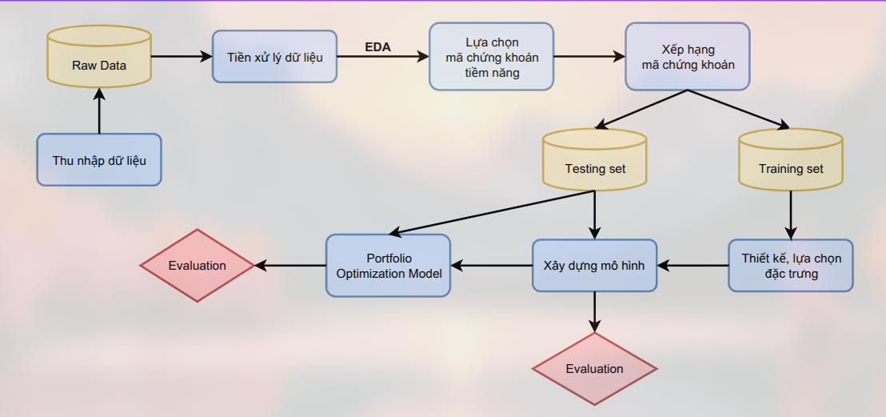
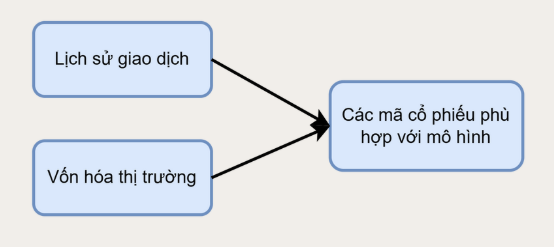
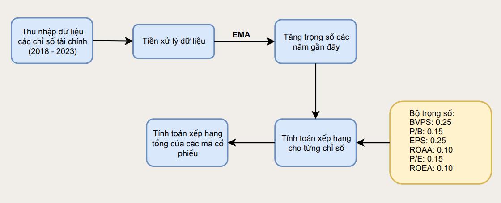

# Tối ưu hóa danh mục đầu tư
Project là đề tài vòng chung kết cuộc thi DataFlow.

## Giới thiệu
Thị trường chứng khoán Việt Nam gần đây có những biến động đáng kể, việc phân tích danh mục đầu tư trở thành một vấn đề cấp thiết. Project này sẽ tập trung vào các mục tiêu:
- Thu nhập dữ liệu chứng khoán
- Phân tích và lựa chọn danh mục đầu tư
- Xây dựng mô hình tối ưu hóa danh mục
- Đưa ra khuyến nghị đầu tư

---

## Lưu đồ xây dựng bài toán

---
## Dữ liệu 
Dữ liệu được thu nhập từ hai trang web chính:  CafeF và VietStock. Các ngành: Ngân hàng, Công nghệ thông tin, Bất động sản, Năng lượng. Ứng với từng mã chứng khoán, dữ liệu bao gồm các trường thông tin: thông tin của mỗi mã chứng khoán, lịch sử giao dịch và các chỉ số tài chính của mỗi mã chứng khoán qua các năm.

---
## Lựa chọn mã cổ phiếu phù hợp
Mô hình MPT giả định rằng lợi nhuận của tài sản tài chính tuân theo phân phối chuẩn, nhưng thực tế thì không. Mô hình MPT chưa xét đến các yếu tố khối lượng giao dịch, vốn hóa. Thị trường chứng khoán Việt Nam thường có những mã cổ phiếu bị thao túng, mà mô hình MPT hoạt động tốt nhất trong một thị trường có giá cổ phiếu phản ánh đầy đủ thông tin. Do đó, việc lọc các mã cổ phiếu là cần thiết để mô hình MPT hoạt động hiệu quả

**Lựa chọn mã cổ phiếu**
Mục đich của bước này là Kiểm soát rủi ro, khắc phục điểm yếu và cải thiện độ chính xác của mô hình tối ưu danh mục bằng việc sử dụng các tiêu chí: **Khối lượng giao dịch (volume) và giá trị vốn hóa (market cap), Phân phối lợi nhuận – tập trung vào chỉ số VaR và CAGR (Compound Annual Growth Rate)**

**Xếp hạng mã cổ phiếu**
Bước thứ hai là xếp hạng các mã cổ phiếu còn lại dựa trên các chỉ số tài chính cơ bản (fundamental indicators). Mục đích của bước này là:
- Đánh giá tổng thể các mã cổ phiếu: Việc kết hợp nhiều chỉ số tài chính giúp xem xét đồng thời các khía cạnh khác nhau của doanh nghiệp
- Hỗ trợ chọn lọc cổ phiếu: Cung cấp danh sách các mã cổ phiếu có nền tảng tài chính vững chắc thuận lợi cho việc đưa vào mô hình chuỗi thời gian và mô hình tối ưu danh mục đầu tư.
- Đảm bảo tính khách quan
- Tăng hiệu quả đầu tư dài hạn

---
## Tối ưu hóa danh mục đầu tư

Để xem kết quả chi tiết hãy xem tại slide ở github hiện tại.